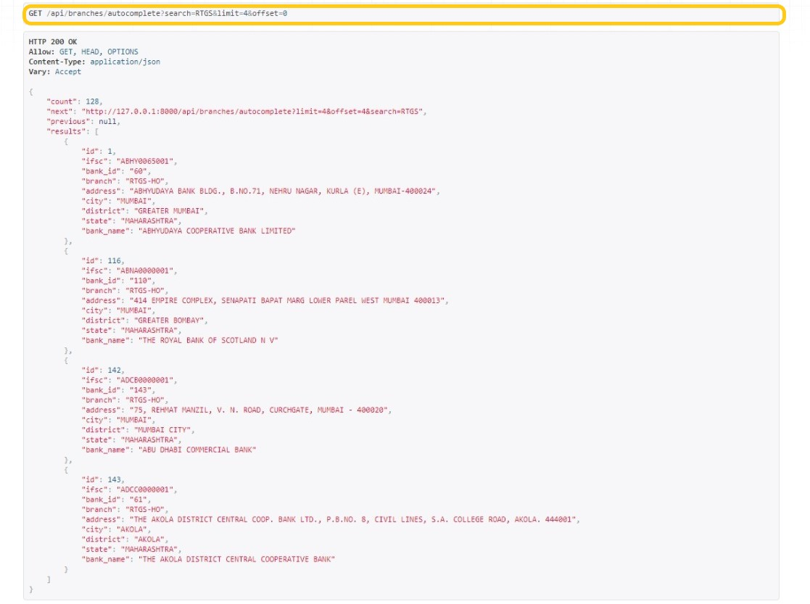
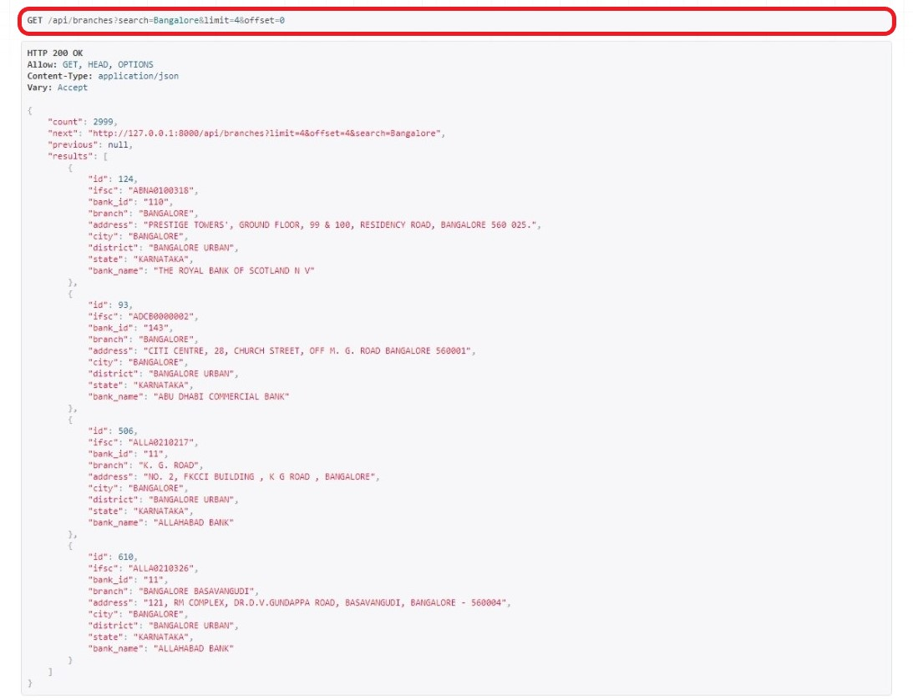

## Assignment
 Create a REST service that can fetch bank details, using the data given in the API’s query parameters.

## Environment

```sh
$  pip install -r requirements.txt
```


## Run


```python
python manage.py makemigrations
python manage.py migrate
python manage.py runserver
```

1. Autocomplete API to return possible matches based on the branch name **ordered by IFSC code** (ascending order) with limit and offset.
    1. **Endpoint: /api/branches/autocomplete?q=<>**
    2. Example: /api/branches/autocomplete?q=**RTGS**&limit=3&offset=0
    3. Sample response:

       

2. Search API to return possible matches across all columns and all rows, **ordered by IFSC code** (ascending order) with limit and offset.
     1. **Endpoint: /api/branches?q=<>**
     2. Example: /api/branches?q=**Bangalore**&limit=4&offset=0
     3. Sample response:

      
